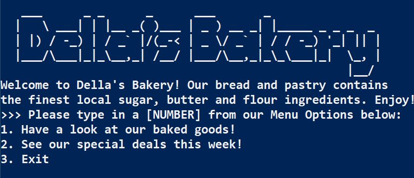
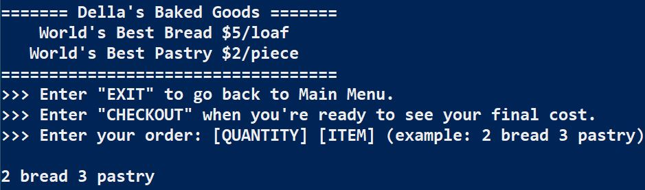
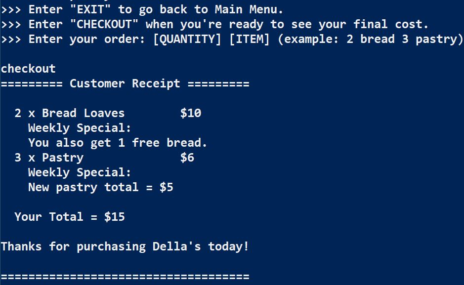
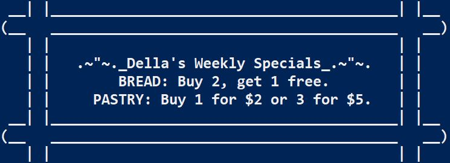

# [Della's Bakery](https://github.com/ayohana/my-bakery/)

#### C# Basics Exercise for [Epicodus](https://www.epicodus.com/), 02.28.2020

#### By [**Adela Darmansyah**](https://ayohana.github.io/portfolio/)

## Description

**This C# console application is for customers at Della's Bakery.** A customer will be able to specify their order of baked goods and the application will display the total cost of their order. Here is a list of prices of their bakery items and special deals:
  * $5/bread loaf
  * $2/pastry
  * Bread special deal: Buy 2 get 1 free
  * Pastry special deal: Buy 1 for $2 or 3 for $5

## Screenshots

#### How to place an order:

#### Display of customer receipt upon checkout:

#### Display of the bakery's special deals:

## User Stories

* As a customer, I want to be able to see the list of baked goods they sell at the bakery so that I can enter my order.
* As a customer, I want to be notified of my total cost so that I can pay the correct amount.
* As a baker from Della's Bakery, I want to have a sweet welcome message displayed at the opening of the application so that customers feel welcomed.
* As a baker from Della's Bakery, I want to have our special deals displayed so that customers would be aware of them.
* As a developer, I want to have a separate constructor for each item so that I can easily change their base price.

## Specs

  
Click to expand!

| Spec | Input | Output |
| :-------------     | :------------- | :------------- |
| **Program Displays Welcome Message and Menu** | Opening of application | Welcome Message & Menu Displayed |
| **Program Gathers User Input of Bread and Returns Total Cost of Bread** | 2 bread | $10 |
| **Program Gathers User Input of Pastry and Returns Total Cost of Pastry** | 1 pastry | $2 |
| **Program Gathers User Input of Bread & Pastry and Returns Total Cost of Shopping Cart** | 2 bread 1 pastry | $12 |
| **Program Additionally Displays Special Deals with Welcome Message and Menu** | Opening of application | Welcome Message, Menu & Special Deals Displayed |
| **Program Applies Special Bread Deal** | 2 bread | $10 + FREE 1 bread loaf |
| **Program Applies Special Pastry Deal** | 3 pastry | $5 |

## Setup/Installation Requirements

* Download [.NET Core](https://dotnet.microsoft.com/download/dotnet-core/)
* Clone this [repository](https://github.com/ayohana/my-bakery/)
* Open the `Command Line Interface`.
  * Navigate into the repository.
  * Enter the command `dotnet run` to run the application.

_Enjoy!_

## Known Bugs

No known bugs at this time.

## Improvement Opportunities

* `ShoppingCart` instance currently only gathers the last user input.
* Display content of `ShoppingCart` prior to checkout.

## Support and contact details

Feel free to provide feedback via email: adela.yohana@gmail.com.

## Technologies Used

* C#
* [.NET Core](https://dotnet.microsoft.com/download/dotnet-core/)
* Markdown

### License

This C# console application is licensed under the MIT license.

Copyright (c) 2020 **Adela Darmansyah**